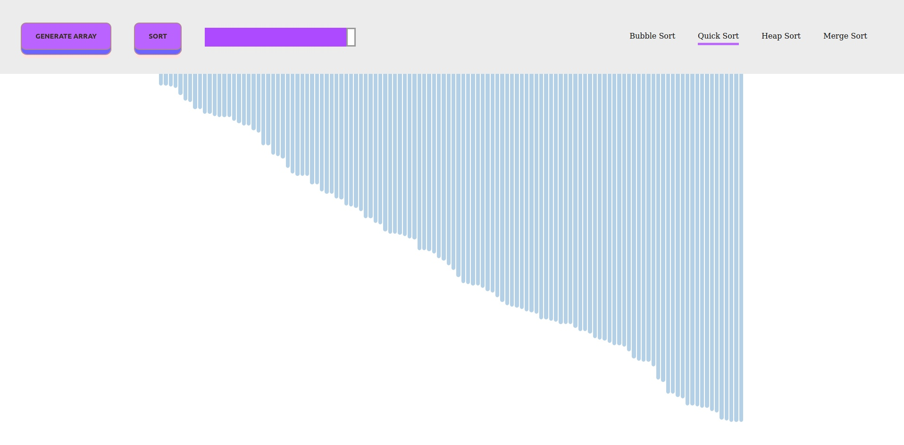

# Sorting Visualizer

## [Watch it live](https://gulevskydev-sorting-visualier.netlify.app/)



## You can clone it and run:

```bash
npm install
npm run start
```

This will start a live-server with the project running.

## Visualization of popular sorting algorithms.

1. Bubble Sort
2. Quick Sort
3. Merge Sort
4. Heap Sort

The more elements - the faster the animation speed. Just play with it :)
